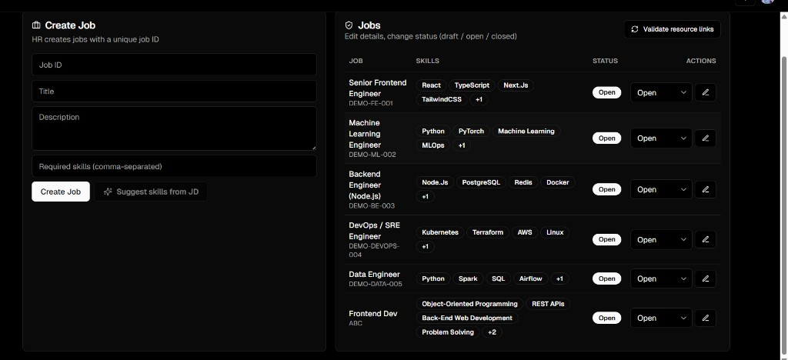
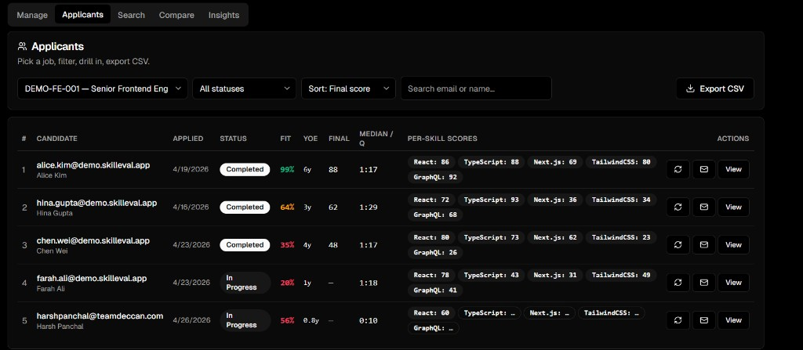
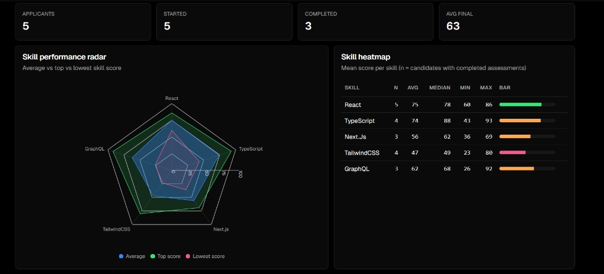
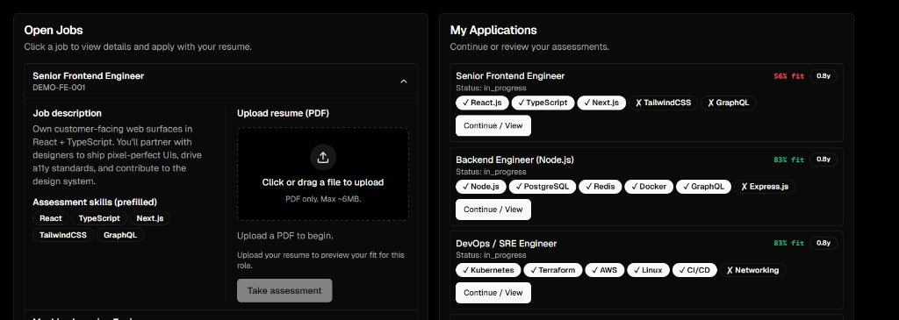
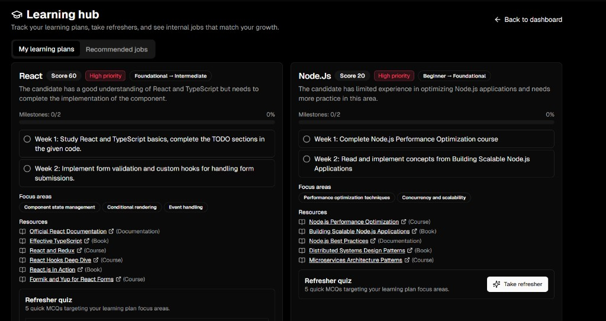
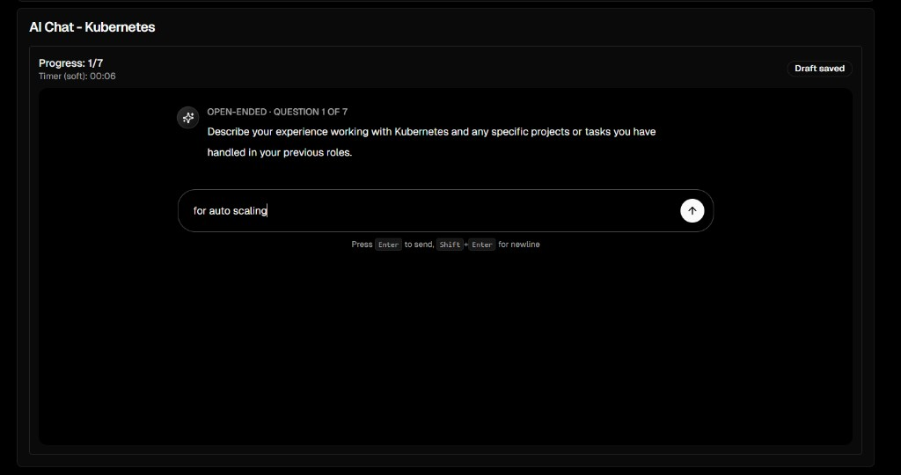
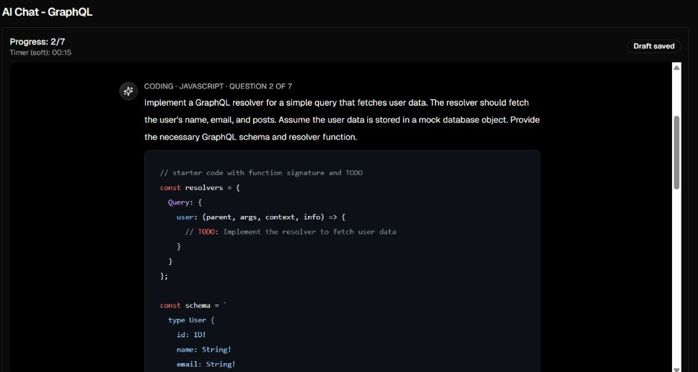
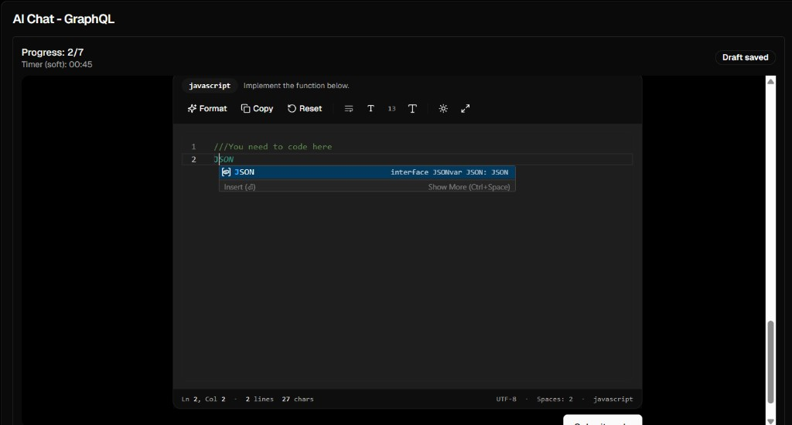
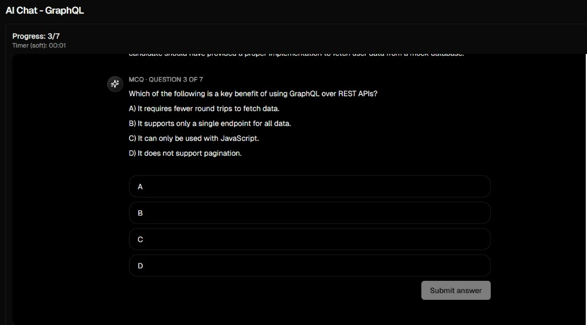
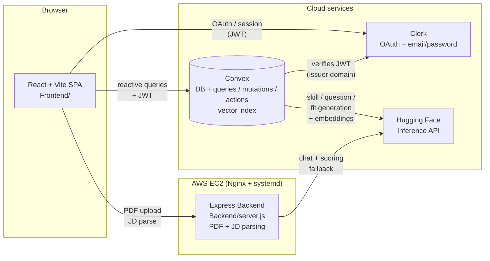

# SkillEval

**AI-based candidate evaluation from resumes.**

A full-stack platform that helps companies evaluate candidates beyond keyword matching, and helps candidates discover where they stand and how to grow.

🌐 **Live demo:** [https://harshpanchal.duckdns.org/](https://harshpanchal.duckdns.org/)

🎥 **Demo video:** [Watch on Google Drive](https://drive.google.com/file/d/17w8XTSVQVYZ3dMnzTymqX3Fvp4VZqrX_/view?usp=sharing)

---

## Try the Admin View

A shared demo admin account is already provisioned, so anyone can poke around the recruiter / RBAC side without creating a Clerk user.

| Field | Value |
|---|---|
| Email | `demo.admin+clerk_test@example.com` |
| Password | `catalyst@deccan` |

**Steps**

1. Open the [live demo](https://harshpanchal.duckdns.org/) and click **Sign in**.
2. Paste the email and password above.
3. You'll land directly on the admin dashboard (Manage / Applicants / Insights / Search).

> Why the unusual email: the deployment runs on a Clerk **development** instance, where any address of the form `*+clerk_test@<domain>` is treated as a fictitious test address — Clerk skips real email delivery and uses a fixed verification code (`424242`) for any future sign-up flow ([Clerk docs](https://clerk.com/docs/testing/test-emails-and-phones)). This particular address is also listed in `ADMIN_EMAILS` / `VITE_ADMIN_EMAILS`, so the app's RBAC layer (`convex/auth.ts`) auto-grants it the `admin` role.

To explore the candidate flow instead, sign up with any other email (a real address you own, or another `+clerk_test@example.com` variant verified with code `424242`) and you'll be routed to the candidate dashboard.

---

## Deployment

- Hosted on a personal **AWS EC2** instance
- Frontend served by **Nginx**
- Backend runs as a **systemd** daemon for reliability and auto-restarts

## Tech Stack

- **Frontend:** React 18 + Vite, TailwindCSS, shadcn/ui, Recharts, Monaco editor
- **Auth:** [Clerk](https://clerk.com/) (Google OAuth + email/password) bridged to Convex via JWT
- **Backend:** Express.js (PDF parsing, JD parsing, legacy LLM proxy)
- **Database / serverless functions:** [Convex](https://www.convex.dev/) — reactive persistence, vector index, queries / mutations / actions
- **LLM:** Hugging Face Inference API (default model: `Qwen/Qwen2.5-7B-Instruct`)

---

## Features

### Admin (RBAC view)

- **Create job postings** with a job ID, role name, job description, and required skill set
- **Compare candidates** for a given job side-by-side and see how each performs relative to others
- **Aggregate analytics** showing overall candidate performance for any job
- **Vector search** across all resumes and applicants using embeddings — find candidates by meaning, not just keywords
- **Fit score** showing the overlap between a job's required skills and a candidate's skills

**Manage** — create new postings and edit / open / close existing jobs, with AI-suggested required skills extracted from the JD:



**Applicants** — ranked candidate table with status, fit score, years of experience, final score, median time per question, and per-skill breakdown:



**Insights** — per-job KPIs plus a skill performance radar (avg / top / lowest) and a skill heatmap across all completed candidates:



### Candidate

- Browse multiple **open job listings** and submit a resume to any of them
- See a personal **fit score** showing the overlap between their skills and the job's requirements
- Take an **AI-driven assessment** tailored to the role, evaluating proficiency across multiple skills
- The AI conversationally probes the candidate via:
  - **Descriptive subjective questions**
  - **Multiple-choice questions (MCQs)**
  - **Coding questions** solved in an in-browser code editor provided by the platform
- After the assessment, the AI generates a **curated upskilling plan** for weak skills, including:
  - Deadlines
  - Recommended resources — Udemy courses, blogs, official docs, and YouTube videos

**Dashboard** — open jobs with skill prefill and resume upload, alongside the candidate's own applications and per-job fit:



**Learning hub** — per-skill plans with weekly milestones, focus areas, curated resources, and an MCQ refresher quiz:



#### Assessment formats

The per-skill flow mixes three formats. The AI grades each answer and adapts difficulty.

**Open-ended / descriptive** — free-form chat answer:



**Coding prompt** — problem statement with starter code / TODOs:



**Coding workspace** — Monaco editor with syntax highlighting, formatting, copy/reset, and themes:



**Multiple-choice (MCQ)** — single-select with A / B / C / D options:



---

## Architecture



**Request flow at a glance**

1. User signs in via Clerk (Google OAuth or email/password). Clerk issues a JWT.
2. The React app calls Convex directly using `ConvexProviderWithClerk`. Convex verifies the JWT against the Clerk issuer domain and runs queries / mutations / actions.
3. PDFs are uploaded to the Express backend (`/api/parse-resume-pdf`), parsed with `pdf-parse`, and the extracted text is sent back to the client which then submits it to Convex.
4. Convex actions call Hugging Face for: structured resume parsing, fit-score generation, embeddings (vector search), per-skill question generation, answer scoring, and curated learning plans.

---

## Scoring Logic

Candidates are evaluated in three layers — first against the JD on paper, then per question, then rolled up per skill into a final score.

**1. Fit score (resume ↔ JD), `convex/resume.ts`**

Computed at apply-time (and as a pre-apply preview) by blending two signals:

- `keywordOverlapPct` — case-insensitive overlap between the resume's extracted skills and the job's required skills.
- `semanticScore` — an LLM holistic 0–100 match that also returns `matchedSkills` / `missingSkills`.
- Final: `fitScore = round(0.45 × keywordOverlapPct + 0.55 × semanticScore)`.

**2. Per-question score (during assessment), `convex/assessments.ts`**

Each of the 7 questions per skill (1 descriptive icebreaker + 1 coding + 3 MCQ + 2 descriptive) is graded by the LLM on a 0–100 scale. The grading rubric considers:

- Correctness against the prompt, edge-case handling, time/space complexity, and idiomatic style for coding answers.
- Concept accuracy and depth for descriptive answers; exact match for MCQs.
- Per-question timing (`startedAt` → `submittedAt`) as a **weak** signal — slow but strong answers aren't penalized; very fast + very weak answers slightly reduce confidence.

**3. Per-skill score and final score**

- After the 7th question for a skill, the LLM emits a holistic `skillScore` (0–100) across the whole skill, plus a conclusion and a curated learning plan.
- Once every required skill is `completed`, the application's `finalScore` is the **arithmetic mean** of all per-skill `skillScore`s.
- That score is mapped to a recommendation band: `≥ 80` → **Strong match**, `≥ 65` → **Potential match**, else **Needs upskilling**.

---

## Folder Structure

```
Hackathon/
├── Backend/                  Express API (PDF parse, JD parse, legacy LLM proxy)
│   ├── server.js             HTTP routes + auth header pass-through
│   ├── assessmentEngine.js   Heuristic scoring + JD skill extraction
│   ├── llmEngine.js          Hugging Face turn / assess wrappers
│   └── store.js              Legacy local JSON store (data/app-store.json)
│
├── convex/                   Convex serverless backend
│   ├── schema.ts             Tables, indexes, vector index
│   ├── auth.config.ts        Clerk JWT issuer config
│   ├── auth.ts               requireUser / requireAdmin helpers
│   ├── users.ts              upsertMe
│   ├── jobs.ts               Job CRUD + AI skill suggestions
│   ├── applications.ts       Apply / list / detail
│   ├── assessments.ts        Per-skill question flow + grading
│   ├── learning.ts           Learning plan, milestones, refresher quiz
│   ├── analytics.ts          Admin dashboards (rankings, aggregates)
│   ├── resume.ts             Structured parsing, fit score, vector search
│   ├── llm.ts                Hugging Face client + prompts
│   ├── crons.ts              Scheduled link-health validation
│   ├── seed.ts               Demo data seed / wipe
│   └── _generated/           Auto-generated Convex types
│
├── Frontend/                 React + Vite client
│   ├── src/
│   │   ├── main.jsx          Clerk + Convex providers, router
│   │   ├── App.jsx           Routes, sign-in screen, dashboard shell
│   │   ├── components/
│   │   │   ├── admin/        Manage / Applicants / Search / Compare / Insights tabs
│   │   │   ├── candidate/    Jobs, applied jobs, learning hub
│   │   │   ├── prompt-kit/   Chat container, message, prompt input
│   │   │   └── ui/           shadcn / Aceternity primitives
│   │   └── lib/              utils, resource link helpers
│   ├── public/
│   ├── vite.config.js
│   └── package.json
│
├── data/                     Local JSON store used by the legacy Express paths
├── public/                   Static assets served by Express in single-host mode
├── package.json              Root package (Backend + Convex deps)
└── README.md
```

---

## Local Setup

### Prerequisites

- **Node.js 20+** and **npm**
- A **Clerk** account (publishable + secret key, with Google OAuth and Email/Password sign-in enabled)
- A **Convex** account (`npx convex` will provision a deployment on first run)
- A **Hugging Face** access token

### 1. Clone and install

```bash
git clone <your-fork-url> Catalyst
cd Catalyst

npm install
cd Frontend && npm install && cd ..
```

### 2. Configure environment variables

Copy the templates and fill in your own values:

```bash
cp .env.example .env
cp Frontend/.env.example Frontend/.env
```

See [Backend / Convex env vars](#backend--convex-env-vars-env) and [Frontend env vars](#frontend-env-vars-frontendenv) below for what each one does.

### 3. Bootstrap Convex

The first run links the local code to a Convex deployment and pushes the schema:

```bash
npx convex dev
```

Keep this running in its own terminal — it watches `convex/*.ts` and hot-reloads. Convex will print the deployment URL; copy it into both `CONVEX_URL` (root `.env`) and `VITE_CONVEX_URL` (`Frontend/.env`).

In the Convex dashboard, set the following environment variables for the deployment:

- `CLERK_JWT_ISSUER_DOMAIN`
- `CLERK_SECRET_KEY`
- `ADMIN_EMAILS`
- `HUGGINGFACE_TOKEN`
- `HUGGINGFACE_MODEL`

(Convex actions read these from `process.env` inside the Convex runtime — they aren't auto-loaded from your local `.env`.)

### 4. (Optional) Seed demo data

From the Convex dashboard's Functions tab, run the internal mutation `seed:seedDemo` to populate jobs, candidates, and a few completed assessments. Use `seed:wipeDemo` to clean up.

### 5. Run the apps

In three terminals:

```bash
npx convex dev                  # terminal 1 — Convex watcher
npm run dev                     # terminal 2 — Express on :3000
cd Frontend && npm run dev      # terminal 3 — Vite on :5173
```

Open [http://localhost:5173](http://localhost:5173) and sign in. Any email listed in `VITE_ADMIN_EMAILS` / `ADMIN_EMAILS` lands on the admin dashboard; everyone else gets the candidate flow.

---

## Environment Variables

### Backend / Convex env vars (`.env`)

| Variable | Required | Default | Description |
|---|---|---|---|
| `PORT` | no | `3000` | Port for the Express backend. |
| `HUGGINGFACE_TOKEN` | yes | — | Hugging Face Inference API token, used for question generation, scoring, fit, and embeddings. |
| `HUGGINGFACE_MODEL` | no | `Qwen/Qwen2.5-7B-Instruct` | HF model id used by `llmEngine.js` and Convex `llm.ts`. |
| `ADMIN_EMAILS` | yes | — | Comma-separated list of emails granted the `admin` role by `convex/auth.ts` and `Backend/store.js`. |
| `CONVEX_URL` | yes | — | The Convex deployment URL printed by `npx convex dev` (e.g. `https://xxx.convex.cloud`). |
| `CLERK_SECRET_KEY` | yes | — | Clerk secret key, used by `@clerk/backend` for any server-side verification. |
| `CLERK_JWT_ISSUER_DOMAIN` | yes | — | Clerk Frontend API URL (e.g. `https://your-app.clerk.accounts.dev`). Set this **inside the Convex dashboard** so `convex/auth.config.ts` can verify JWTs. |

### Frontend env vars (`Frontend/.env`)

| Variable | Required | Default | Description |
|---|---|---|---|
| `VITE_CLERK_PUBLISHABLE_KEY` | yes | — | Clerk publishable key shipped to the browser. |
| `VITE_ADMIN_EMAILS` | yes | — | Comma-separated emails that unlock the admin sidebar / dashboard in the SPA. Should mirror the backend `ADMIN_EMAILS`. |
| `VITE_CONVEX_URL` | yes | — | Same Convex deployment URL as the backend. Used by `ConvexReactClient`. |
| `VITE_BACKEND_URL` | no | `http://localhost:3000` | Where the SPA reaches the Express backend (PDF parsing, etc.). |
| `VITE_USE_CONVEX_WITH_CLERK` | no | `true` | When `true`, the SPA wraps the Convex client in `ConvexProviderWithClerk` to forward the Clerk JWT. |

---

## API Reference

### Express endpoints (`Backend/server.js`)

Auth is passed through two custom headers from the SPA: `x-user-email` and `x-user-name`. Endpoints marked **Admin** require `x-user-email` to be in `ADMIN_EMAILS`.

| Method | Path | Auth | Description |
|---|---|---|---|
| `GET` | `/api/health` | public | Liveness probe. |
| `GET` | `/api/company-config` | public | Returns weighting / signal config used by the heuristic assessor. |
| `GET` | `/api/llm-status` | public | Reports whether the HF token is configured and which model is in use. |
| `POST` | `/api/parse-resume-pdf` | public | `multipart/form-data` upload (field `resumePdf`). Returns extracted plain text from the PDF. |
| `POST` | `/api/parse-jd` | public | Body `{ jdText }`. Heuristic skill extraction from a job description. |
| `POST` | `/api/users/upsert` | public | Body `{ email, name }`. Idempotent user upsert in the legacy local store. |
| `GET` | `/api/jobs` | public | Lists open jobs from the local store (legacy candidate flow). |
| `POST` | `/api/admin/jobs` | Admin | Body `{ jobId, title, description, requiredSkills }`. Creates a job in the local store. |
| `GET` | `/api/admin/jobs` | Admin | Lists all jobs (any status). |
| `GET` | `/api/admin/jobs/:jobId/summary` | Admin | Per-job stats + ranked assessment results. |
| `POST` | `/api/applications` | user | Body `{ jobId, resumeFileName, resumeTextSnapshot }`. Creates an application in the local store. |
| `GET` | `/api/my/applications` | user | Lists the caller's applications (joined with their job). |
| `POST` | `/api/applications/:applicationId/start-assessment` | user | Creates / fetches the in-progress session for that application. |
| `GET` | `/api/applications/:applicationId/assessment` | user | Full assessment state: application, job, session, messages, result. |
| `POST` | `/api/applications/:applicationId/assessment-turn` | user | Body `{ userText, skill }`. Drives one chat turn for a skill via the HF LLM. |
| `POST` | `/api/llm-turn` | public | Direct LLM "next-question" turn. Body `{ jdText, resumeText, requiredSkills, messages, structuredAnswers }`. |
| `POST` | `/api/llm-assess` | public | Direct LLM final-report. Body `{ jdText, resumeText, requiredSkills, structuredAnswers }`. |
| `POST` | `/api/assess` | public | Heuristic (non-LLM) assessment. Body `{ jd, resumeText, answers }`. |

> **Note:** Most production traffic goes through Convex (below). The Express endpoints exist for PDF parsing, the legacy local-store flow, and as a fallback LLM proxy.

### Convex functions (`convex/*.ts`)

All Convex functions require a Clerk-authenticated identity unless noted. **Admin** functions additionally require the caller's email to be in `ADMIN_EMAILS`. Internal functions (prefixed `_`) are not exposed publicly.

#### `users.ts`

| Kind | Name | Auth | Description |
|---|---|---|---|
| mutation | `upsertMe` | user | Creates or updates the caller's row in the `users` table. |

#### `jobs.ts`

| Kind | Name | Auth | Description |
|---|---|---|---|
| mutation | `createJob` | Admin | Create a job (`jobId`, `title`, `description`, `requiredSkills`). |
| query | `listJobs` | user | Lists jobs with status `open`. |
| query | `listJobsAdmin` | Admin | Lists every job regardless of status. |
| mutation | `updateJobStatus` | Admin | Update a job's status (`draft` / `open` / `closed`). |
| mutation | `updateJob` | Admin | Edit title, description, required skills. |
| action | `suggestSkillsFromJD` | user | LLM-extracts required skills from a JD. |

#### `applications.ts`

| Kind | Name | Auth | Description |
|---|---|---|---|
| mutation | `applyToJob` | user | Apply with a resume snapshot. Triggers downstream `processApplication`. |
| query | `listMyApplications` | user | Lists the caller's applications. |
| query | `getMyApplicationDetail` | user | Application + job + session + result for the caller. |

#### `assessments.ts`

| Kind | Name | Auth | Description |
|---|---|---|---|
| mutation | `startAssessment` | user | Ensures an `assessmentSessions` row for the application. |
| mutation | `addMessage` | user | Append a chat message to a session. |
| query | `getSessionMessages` | user | Fetch chat history for a session, optionally scoped to one skill. |
| mutation | `storeResult` | user | Persist a final assessment result row. |
| mutation | `startSkillAssessment` | user | Start the per-skill question flow. |
| query | `getSkillAssessment` | user | Read a single skill-assessment row. |
| query | `listSkillAssessmentsForApplication` | user | Read every skill-assessment row for an application. |
| query | `getSkillAnswerDraft` | user | Read the autosaved draft for the current question. |
| mutation | `upsertSkillAnswerDraft` | user | Autosave a draft answer (mcq / descriptive / coding). |
| mutation | `markQuestionStarted` | user | Stamp `startedAt` for soft per-question timing. |
| action | `initializeSkillQuestions` | user | LLM-generates the 7 mixed (mcq / descriptive / coding) questions for a skill. |
| action | `submitSkillAnswer` | user | LLM-scores an answer, advances or completes the skill, generates the per-skill plan. |

#### `learning.ts`

| Kind | Name | Auth | Description |
|---|---|---|---|
| query | `getLearningProgress` | user | Per-milestone completion for a skill assessment. |
| mutation | `setMilestoneStatus` | user | Mark a weekly milestone done / not done. |
| action | `generateRefresherQuiz` | user | LLM-generates a 5-question MCQ refresher for a weak skill. |
| query | `getActiveRefresher` | user | Read the most recent refresher quiz. |
| mutation | `submitRefresherAnswers` | user | Grade an MCQ refresher quiz. |
| query | `getCandidateLearningOverview` | user | Aggregated learning hub view. |
| query | `getRecommendedJobs` | user | Recommends open jobs based on the candidate's strongest skills. |
| action | `validateResourceLinks` | Admin | HEAD-checks every learning-plan resource link and stores health. |

#### `analytics.ts`

| Kind | Name | Auth | Description |
|---|---|---|---|
| query | `jobStats` | Admin | Counts of applicants / started / completed for a job. |
| query | `jobRankings` | Admin | Sorted final-score leaderboard for a job. |
| query | `jobApplicantsDetail` | Admin | Full applicants table with per-skill scores, fit, recommendation. |
| query | `jobSkillAggregate` | Admin | Avg / median / min / max per required skill. |
| query | `getApplicationDetailAdmin` | Admin | Drill-in view of one applicant: structured resume, every skill, every question. |

#### `resume.ts`

| Kind | Name | Auth | Description |
|---|---|---|---|
| action | `processApplication` | user | LLM-parse resume, compute fit score, store embedding (vector index). |
| action | `previewFit` | user | Compute a fit preview without saving (used pre-apply). |
| action | `searchByQuery` | Admin | Vector search across all candidate resumes; optional `jobIdRef` scope. |
| action | `reprocessApplication` | Admin | Re-run resume parse + fit + embedding for one application. |

#### `crons.ts`

A scheduled job that calls `learning:validateResourceLinksInternal` daily to keep the resource-health table fresh.

---

## License

MIT
